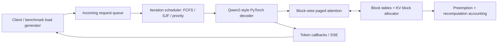

# PyTorch LLM Inference Serving Engine

From-scratch inference mechanics for a Qwen2/Qwen2.5-style decoder: paged KV allocation,
block-wise attention, iteration-level continuous batching, weight-only quantization, and a
reproducible open-loop benchmark harness. It uses PyTorch tensor operations; it does **not** wrap
vLLM, TensorRT-LLM, or another serving engine.

| Config | Throughput (tok/s) | p95 TTFT | p95 TPOT | Peak GPU mem | Accuracy delta |
|---|---:|---:|---:|---:|---:|
| Naive baseline | run on target hardware | run | run | run | reference |
| + paged KV cache | run on target hardware | run | run | run | 0 |
| + continuous batching | run on target hardware | run | run | run | 0 |
| + INT8 weights | run on target hardware | run | run | run | run WikiText/HellaSwag |
| + packed INT4 weights | run on target hardware | run | run | run | run WikiText/HellaSwag |
| + speculative decoding | run on target hardware | run | run | run | acceptance by domain |

The table is intentionally not populated with invented or cross-machine numbers. One command
produces every latency and throughput cell from the same seeded workload; a second produces the
accuracy-versus-throughput points. Generated artifacts live under `artifacts/` and are excluded
from source control so hardware-specific results cannot silently become universal claims.

## What is implemented

- **Phase 0 — measuring stick:** deterministic open-loop arrivals; clipped log-normal prompt and
  output lengths; per-request TTFT, TPOT, p50/p95/p99 end-to-end latency; output throughput; NVML
  utilization and memory high-water sampling; JSON and CSV output.
- **Phase 1 — deliberately naive baseline:** one request at a time and a full-prefix forward pass
  for every generated token. A lock prevents concurrent callers from accidentally turning it into
  a batched baseline.
- **Phase 2 — paged KV cache:** fixed-size physical blocks, per-sequence block tables, an O(1)
  free-list allocator, block-level memory accounting, LRU/largest-sequence eviction metadata, and
  explicit recomputation counters after preemption. The attention path uses online softmax over
  physical blocks; it never assembles a contiguous KV cache.
- **Phase 3 — continuous batching:** requests are admitted between token iterations, so a new
  request joins the next model step. Static batching is available as the control. FCFS, SJF, and
  priority policies share the same scheduler and model path.
- **Phase 4 — quantization curve:** symmetric per-output-channel INT8 and packed INT4 weights,
  with WikiText-2 perplexity, HellaSwag accuracy, matched decode throughput, and model-size
  reporting. This is intentionally described as a simple weight-only scheme, not GPTQ or AWQ.
- **Phase 5 — speculative decoding:** greedy draft proposals, one target verification pass per
  proposal block, bonus tokens, and acceptance/target-pass reporting.
- **Phase 6 — production surface:** OpenAI-compatible `POST /v1/completions`, SSE streaming,
  Prometheus metrics, a provisioned Grafana dashboard, Docker Compose, and a constant-arrival-rate
  k6 workload mirroring the benchmark distributions.

## Architecture



The uncached reference path uses PyTorch scaled-dot-product attention. The serving path is separate:
each layer projects Q/K/V, writes K/V to a physical cache slot, then performs numerically stable
online softmax while traversing that sequence's block table. See [architecture.md](docs/architecture.md).

## Quick start

Python 3.10–3.13 is supported.

```bash
uv sync --extra all
uv run pytest

# Fast CPU smoke test with the bundled tiny random model.
uv run llmserve benchmark \
  --config continuous \
  --requests 8 \
  --arrival-rate 20 \
  --output artifacts/smoke.json
```

The random model tests engine behavior; it does not produce meaningful language or accuracy.

### Local validation smoke run

These are test-run numbers, not model-serving claims: 4 requests, the bundled random 4-layer model,
PyTorch 2.13.0 on an arm64 CPU, one run, no warm-up. They prove that the harness produces a number
for every configuration and, usefully, show a failure: readable Python block traversal is slower
than PyTorch's optimized dense kernel.

| Smoke config | Throughput (tok/s) | p95 TTFT | p95 TPOT | Cache memory reduction vs contiguous |
|---|---:|---:|---:|---:|
| Naive sequential | 337.8 | 386.9 ms | 3.18 ms | n/a |
| Paged, batch 1 | 102.2 | 1,914.8 ms | 7.07 ms | 75.0% |
| Static, batch 4 | 110.6 | 1,449.0 ms | 15.81 ms | 85.9% |
| Continuous, batch 4 | 112.7 | 1,052.2 ms | 19.57 ms | 85.5% |

The matched tiny-model quantization smoke test reduced stored model bytes by 59.7% with INT8 and
70.4% with INT4. INT4 worsened perplexity by 4.89 and both modes reduced CPU throughput because the
reference layers dequantize before GEMM. Those regressions are documented instead of renamed wins.

## Benchmark a real model

The direct checkpoint loader maps Qwen2/Qwen2.5 safetensors into this repository's decoder modules.
It does not call `transformers` for model inference. The tokenizer is the only Transformers runtime
component.

```bash
uv sync --extra all

for config in naive paged static continuous; do
  uv run llmserve benchmark \
    --model Qwen/Qwen2.5-1.5B \
    --device cuda \
    --config "$config" \
    --policy fcfs \
    --profile configs/benchmark-sharegpt.yaml \
    --output "artifacts/${config}.json"
done

# Scheduler fairness/tail-latency comparison.
for policy in fcfs sjf; do
  uv run llmserve benchmark \
    --model Qwen/Qwen2.5-1.5B \
    --device cuda \
    --config continuous \
    --policy "$policy" \
    --output "artifacts/continuous-${policy}.json"
done
```

All runs reuse the seed and load profile from `configs/benchmark-sharegpt.yaml`. Do not compare two
configurations produced with different profiles, model revisions, warm-up rules, or hardware. Full
methodology and failure-regime experiments are in [benchmarking.md](docs/benchmarking.md).

## Quantization: accuracy versus throughput

```bash
uv run llmserve quantize-eval \
  --model Qwen/Qwen2.5-1.5B \
  --device cuda \
  --eval-tokens 8192 \
  --hellaswag-samples 100 \
  --output artifacts/quantization.json

uv run python scripts/plot_quantization.py \
  artifacts/quantization.json \
  --output artifacts/accuracy-throughput.png
```

The current reference quantizer dequantizes weights before each PyTorch linear operation. That makes
the memory/accuracy experiment valid but is not guaranteed to improve wall-clock throughput on every
device; a regression is a result worth reporting. A fused packed GEMM is the clear next optimization.

## Serve completions

```bash
# Tiny local smoke service.
uv run llmserve serve

# Real checkpoint on one GPU.
uv run llmserve serve --model Qwen/Qwen2.5-1.5B --device cuda

curl http://localhost:8000/v1/completions \
  -H 'Content-Type: application/json' \
  -d '{"model":"Qwen/Qwen2.5-1.5B","prompt":"Paged attention is","max_tokens":32,"stream":false}'
```

For the full observability stack:

```bash
docker compose up --build
k6 run loadtests/completions.js
```

The API is at `:8000`, Prometheus at `:9090`, and Grafana at `:3000`.

## Honest limitations

- The paged-attention kernel is written for clarity in ordinary PyTorch. It has correct block-wise
  semantics and bounded temporary memory, but Python-level block traversal leaves performance on the
  table versus a fused Triton/CUDA kernel.
- Prefill currently advances one token per active sequence per scheduler iteration. Chunked prefill
  and prefix sharing are not implemented.
- Direct checkpoint loading currently targets the Qwen2 architecture and safetensors format.
- Speculative verification is greedy. Sampling-correct rejection/resampling is future work.
- No performance claim belongs on a resume until the checked-in commands have been run on named
  hardware and the raw artifacts have been reviewed.

## Repository map

```text
src/llmserve/
  benchmark/        open-loop workload, GPU monitor, metrics, reports
  model.py          Qwen2-style decoder and block-wise paged attention
  kv_cache.py       allocator, block tables, eviction, memory accounting
  scheduler.py      static/continuous admission and scheduling policies
  engine.py         naive reference and asynchronous serving engine
  quantization.py   per-channel INT8 and packed INT4 linears
  evaluation.py     WikiText perplexity and HellaSwag accuracy
  speculative.py    draft/target verification
  service/          FastAPI, SSE, and Prometheus instrumentation
```

## License

MIT
